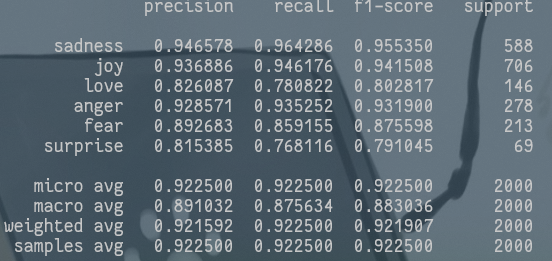

# Sentiment Analysis

*Sentiment* *analysis* *on* IMDB and Emotion Dataset using LSTM.      

## IMDB

```shell
wget http://ai.stanford.edu/~amaas/data/sentiment/aclImdb_v1.tar.gz.
```

## Emotion Dataset

six emotions

```shell
wget https://www.dropbox.com/s/607ptdakxuh5i4s/merged_training.pkl
```

Get more message about the dataset from this [repo](https://github.com/dair-ai/emotion_dataset).


Result on Test Data



